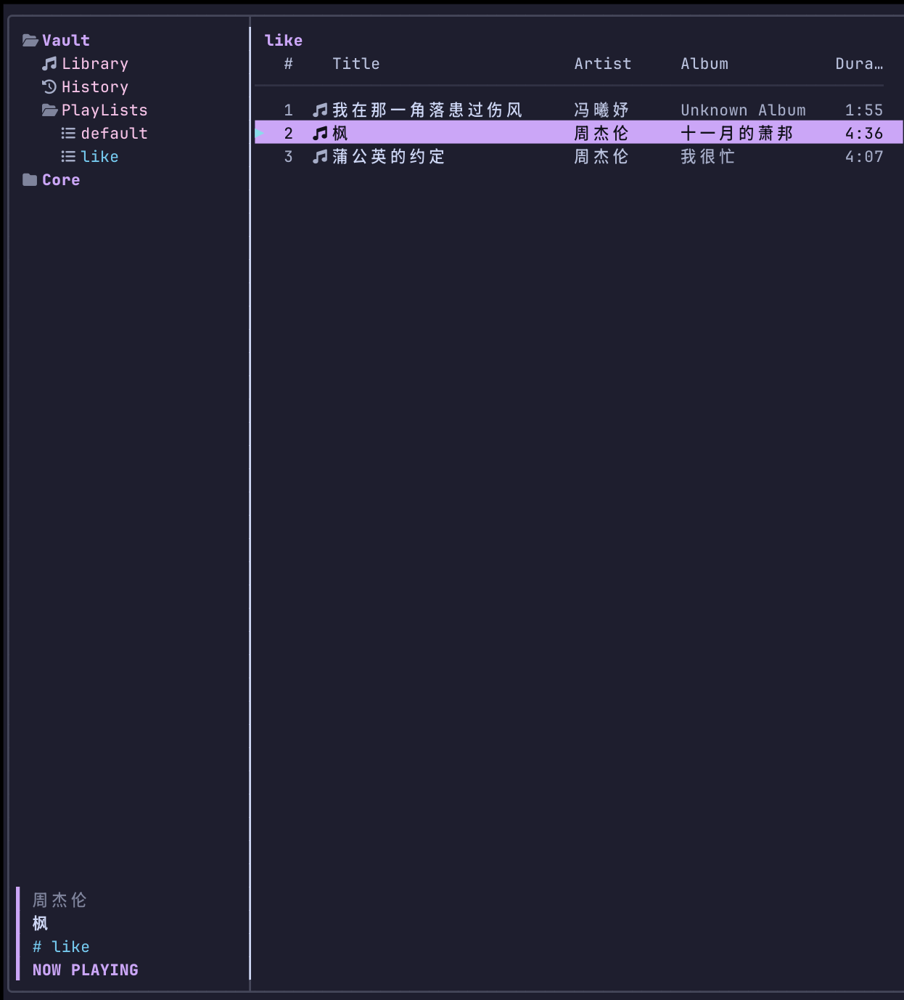
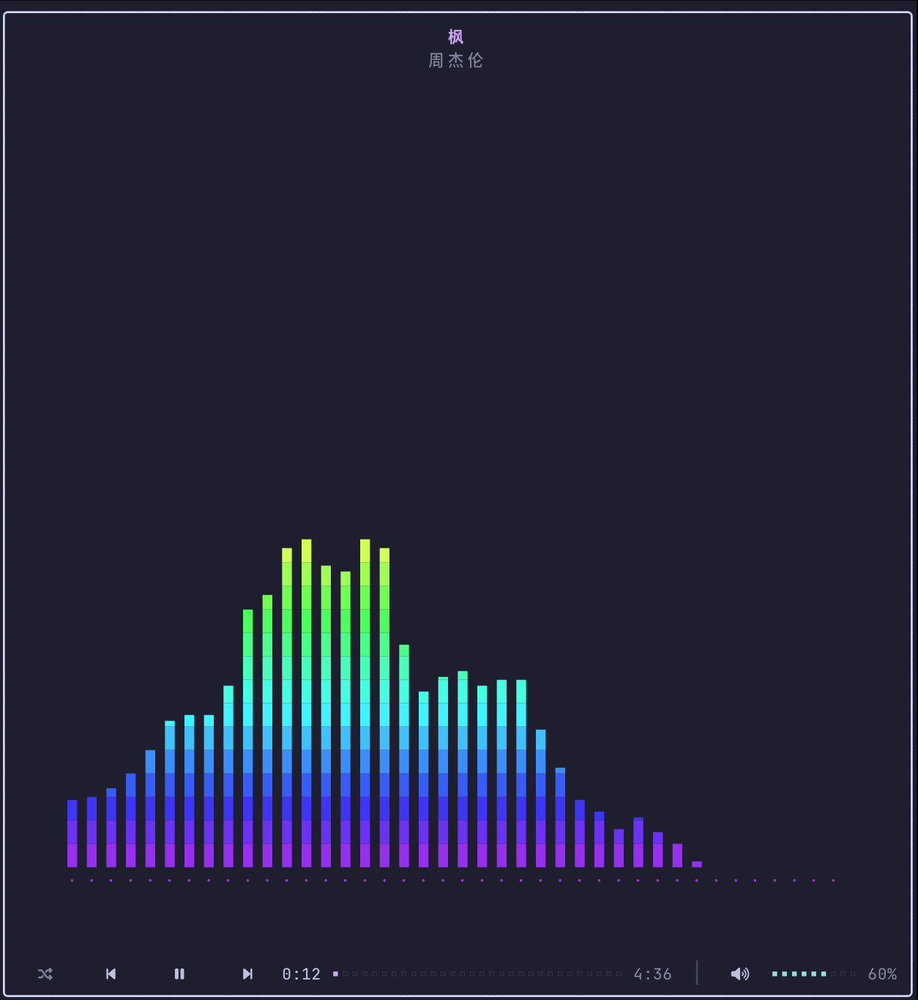

# termusic

termusic is a lightweight, keyboard-driven terminal music client for MPD (Music Player Daemon). It lets you browse your music library, control playback, search for tracks, manage playlists, switch themes, view playback history, load plugins, and display a spectrum visualizer. It can connect to an MPD server running locally or remotely.

## Demo




## Requirements

- A C++20-compatible compiler
- CMake 3.20 or later
- Git
- Meson
- Ninja

Install the build dependencies on Ubuntu / Debian:

```bash
sudo apt update
sudo apt install build-essential cmake git meson ninja-build
```

Install the build dependencies on Fedora:

```bash
sudo dnf install gcc-c++ cmake git meson ninja-build
```

FTXUI, libmpdclient, and kissfft are downloaded automatically during the first build and linked statically, so their development packages do not need to be installed separately.

## MPD playback backend

MPD is required for playback but is not a build dependency. If an MPD server is already available locally or remotely, skip the local setup below.

To connect to a remote server, run termusic with its address:

```bash
./build/termusic --host <MPD_HOST> --port <MPD_PORT>
```

You can also save the address under **Core → General → Host / Port → Save and reconnect**.

### Install MPD when no backend is available

Ubuntu / Debian:

```bash
sudo apt update
sudo apt install mpd mpc
```

Fedora:

```bash
sudo dnf install mpd mpc
```

`mpc` is only used to verify the MPD setup. Other downloads are available from the [official MPD download page](https://www.musicpd.org/download.html).

### Configure a user MPD service

This guide uses the user service and `$HOME/Music`. A system MPD service normally uses `/etc/mpd.conf` and `/var/lib/mpd/music`; stop it first so it does not occupy port 6600:

```bash
sudo systemctl disable --now mpd.service mpd.socket
systemctl --user disable --now mpd.socket
```

Create the music, playlist, data, and configuration directories:

```bash
mkdir -p "$HOME/Music" "$HOME/.config/mpd" "$HOME/.local/share/mpd/playlists"
```

Create `$HOME/.config/mpd/mpd.conf` with this content:

```conf
music_directory    "~/Music"
playlist_directory "~/.local/share/mpd/playlists"
db_file            "~/.local/share/mpd/database"
log_file           "~/.local/share/mpd/log"
pid_file           "~/.local/share/mpd/pid"
state_file         "~/.local/share/mpd/state"
sticker_file       "~/.local/share/mpd/sticker.sql"

bind_to_address "127.0.0.1"
port            "6600"
auto_update     "yes"

audio_output {
    type       "pulse"
    name       "Desktop audio"
    mixer_type "software"
}
```

The `audio_output` block enables software volume control. Start MPD now and automatically after future logins:

```bash
systemctl --user enable --now mpd
systemctl --user status mpd --no-pager
```

If the user service is unavailable, start MPD directly:

```bash
mpd "$HOME/.config/mpd/mpd.conf"
```

Copy or move at least one supported audio file into `$HOME/Music`, update the database, and verify the backend:

```bash
cp /path/to/your/song.mp3 "$HOME/Music/"
mpc update --wait
mpc stats
mpc outputs
mpc volume 50
```

`mpc stats` should report at least one song and the final command should report `volume: 50%`. If the PulseAudio output is unavailable, replace `type "pulse"` with `type "pipewire"` or `type "alsa"`, then restart MPD. After adding music, run `mpc update --wait` or select **Core → General → Update database**.

### Default playlist

termusic always shows a read-only **Default** playlist at the top of **PlayLists**. It automatically displays every song in the MPD media library and updates after an MPD database scan. **Default** cannot be renamed, deleted, reordered, or used as a paste destination; create another playlist for manual editing.

## Clone

```bash
git clone https://github.com/magicptr/termusic.git
```

## Build

```bash
cd termusic
cmake -S . -B build -G Ninja -DCMAKE_BUILD_TYPE=Release -DBUILD_TESTING=OFF
cmake --build build -j
```

## Run

```bash
./build/termusic
```

termusic connects to `127.0.0.1:6600` by default.

## Install

Install system-wide:

```bash
sudo cmake --install build
termusic
```

Install for the current user only:

```bash
cmake --install build --prefix "$HOME/.local"
termusic
```

If `$HOME/.local/bin` is not in your `PATH`, run termusic directly:

```bash
"$HOME/.local/bin/termusic"
```

## Keyboard Shortcuts

### Global

| Shortcut | Action |
| --- | --- |
| `q` | Quit |
| `Esc` | Cancel or go back |
| `Space` | Play or pause |
| `r` | Toggle repeat |
| `s` | Toggle shuffle |
| `1` | Switch to the music library (Vault) |
| `2` | Switch to settings (Core) |
| `i` | Enter or leave the Now Playing view |

### Navigation

| Shortcut | Action |
| --- | --- |
| `j` / `k` | Move down or up |
| `h` / `l` | Return to the left pane or enter the right pane |
| `Enter` | Open, confirm, or play the selected track |
| `g g` / `G` | Jump to the first or last item |
| `PageDown` / `PageUp` | Move down or up by one page |
| `Ctrl+d` / `Ctrl+u` | Move down or up by one page in the track list |

### Library and Playlists

| Shortcut | Action |
| --- | --- |
| `/` | Search the current list |
| `n` / `N` | Jump to the next or previous search result |
| `a` | Create a playlist |
| `r` | Rename the selected playlist |
| `d d` | Delete the selected track or playlist |
| `y y` | Copy the selected track to the register |
| `p` | Paste tracks from the register into a playlist |
| `v` | Enter visual selection mode |
| `K` / `J` | Move a track up or down in the playback queue |

In visual selection mode, use `j` and `k` to extend the selection, press `y` to copy, `d` to delete, or `Esc` to exit.

### Now Playing View

| Shortcut | Action |
| --- | --- |
| `h` / `l` | Previous or next track |
| `j` / `k` | Decrease or increase the volume |
| `,` / `.` | Seek backward or forward |
| `Space` | Play or pause |
| `i` / `Esc` | Leave the Now Playing view |

Except for the reserved quit key `q`, shortcuts can be changed under **Core → Keybindings**. Press `R` on that page to restore all default bindings.

---

termusic is still under active development. If you encounter a problem or have a suggestion, please [contact me](mailto:yiwithming@gmail.com).
